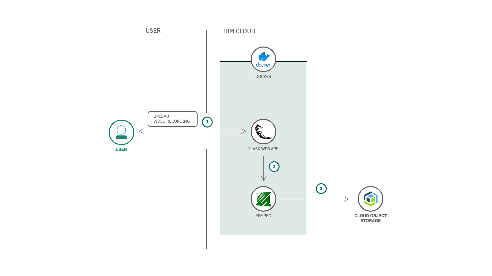
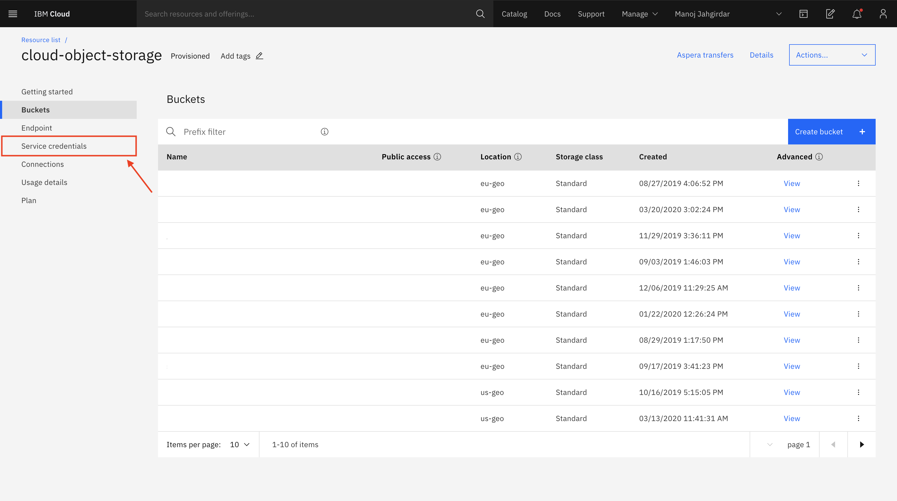
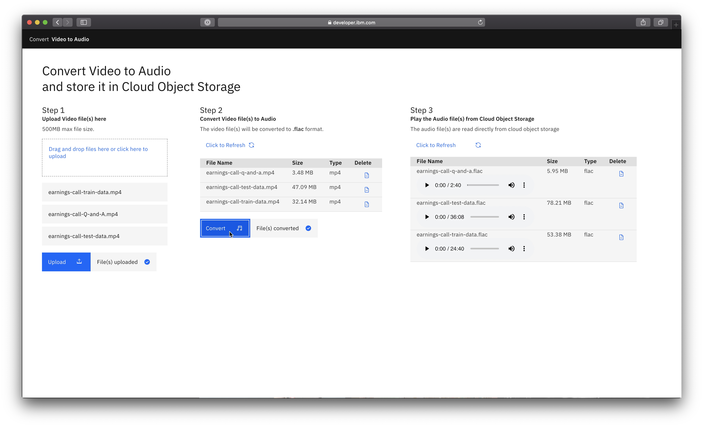

** WORK IN PROGRESS **
# Convert Video to Audio and Store it in Cloud Object Storage

In this code pattern, we will convert video files to audio files using an open-source library **FFMPEG** and store it in **Cloud Object Storage.** 

This Code Pattern is part of the series [Extracting Textual Insights from Videos with IBM Watson]()

The basic idea is to extract textual insights from a video recording using watson services. Watson Natural Language Understanding and Watson Tone Analyzer can generate insights from Text, Watson Speech To Text can generate the text given an audio file. We have a video file as our source hence the first step is to convert the video to audio for further analysis.

When you have completed this code pattern, you will understand how to:

* Connect applications directly to Cloud Object Storage.
* Use other IBM Cloud Services and open-source tools with your data.

<!--add an image in this path-->


<!--Optionally, add flow steps based on the architecture diagram-->
## Flow

1. User uploads video file to the application.
2. The FFMPEG library converts the video file to audio file.
3. The converted audio file is finally stored in Cloud Object Storage.

<!--Optionally, update this section when the video is created-->
# Watch the Video

[](https://www.youtube.com/watch?v=Jxi7U7VOMYg)

# Pre-requisites

1. [IBM Cloud](https://cloud.ibm.com) Account.
2. [Docker](https://www.docker.com/products/docker-desktop).


# Steps

1. [Clone the repo](#1-clone-the-repo).
2. [Create Cloud Object Storage Service](#2-create-cloud-object-storage-service).
3. [Add the Credentials to the Application](#3-add-the-credentials-to-the-application).
4. [Run the Application](#4-run-the-application).


### 1. Clone the repo

Clone the `convert-video-to-audio` repo locally. In a terminal, run:

```bash
$ git clone https://github.com/IBM/convert-video-to-audio
```

### 2. Create Cloud Object Storage Service

- Create a [Cloud Object Storage Service](https://cloud.ibm.com/catalog/services/cloud-object-storage) on IBM Cloud.

- In Cloud Object Storage Resource Page, Click on **Services Credentials**



- Click on **New credential** and add a service credential as shown. Once the credential is created, copy the credential as it will be used in the next step.


### 3. Add the Credentials to the Application

- Open the **credentials.json** file and paste the credentials copied in [step 2](#2-create-cloud-object-storage-service) and finally save the file.

### 4. Run the Application

<details><summary><b>With Docker Installed</b></summary>

- Build the **Dockerfile** as follows :

```bash
$ docker image build -t convert-video-to-audio .
```

- once the dockerfile is built run the docker file as follows :

```bash
$ docker run -p 8080:8080 convert-video-to-audio
```

- The Application will be available on <http://localhost:8080>

</details>

<details><summary><b>Without Docker </b></summary>

- Install the **FFMPEG** library.

For Mac users run the following command:

```bash
$ brew install ffmpeg
```

Other platform users can refer to the [ffmpeg documentation](https://www.ffmpeg.org/download.html) to install the library.

- Install the python libraries as follows:

```bash
$ pip install -r requirements.txt
```

- Finally run the application as follows:

```bash
$ python app.py
```

- The Application will be available on <http://localhost:8080>

</details>

# Output



Convert the Video and Store it in Cloud Object Storage in just 3 steps:

1. Upload the Videos file `earnings-call-train-data.mp4`, `earnings-call-test-data.mp4` & `earnings-call-Q-and-A.mp4` from the `data` directory.

2. Convert the Video file.
3. Play the Audio file from Cloud Object Storage.

More About the dataset:
For the code pattern demonstration, we have considered `IBM Earnings Call Q1 2019` Webex recording. The data has 40min of IBM Revenue discussion, and 20+ min of Q & A at the end of the recording. We have split the data into 3 parts:

- `earnings-call-train-data.mp4` - (Duration - 24:40)
This is the initial part of the discussion from the recording which we will be using to train the custom Watson Speech To Text model in the second code pattern from the series.

- `earnings-call-test-data.mp4` - (Duration - 36:08)
This is the full discussion from the recording which will be used to test the custom Speech To Text model and also to get transcript for further analysis in the third code patten from the series.

- `earnings-call-Q-and-A.mp4` - (Duration - 2:40)
This is a part of Q & A's asked at the end of the meeting. The purpose of this data is to demonstrate how Watson Speech To Text can detect different speakers from an audio which will be demonstrated in the second code pattern from the series.

<!-- keep this -->
## License

This code pattern is licensed under the Apache License, Version 2. Separate third-party code objects invoked within this code pattern are licensed by their respective providers pursuant to their own separate licenses. Contributions are subject to the [Developer Certificate of Origin, Version 1.1](https://developercertificate.org/) and the [Apache License, Version 2](https://www.apache.org/licenses/LICENSE-2.0.txt).

[Apache License FAQ](https://www.apache.org/foundation/license-faq.html#WhatDoesItMEAN)
